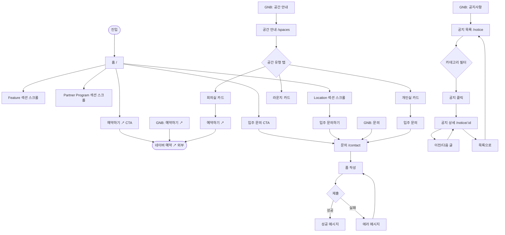

# Grand Soho 웹사이트 — UX Flow

**작성일**: 2026-06-14  
**참조**: `docs/grand-soho-website-plan.md`

---

## 유저 시나리오

### 시나리오 1: 잠재 입주 고객 — 공간 탐색 후 입주 문의

- **사용자**: 시드~Series A 스타트업 창업자, 5~10인 팀
- **목표**: Grand Soho의 공간과 파트너 프로그램을 파악하고 입주 상담 신청
- **플로우**:
  1. 검색 또는 링크를 통해 홈(`/`) 진입
  2. Hero 섹션에서 헤드라인·서브카피 확인
  3. Feature 섹션에서 공간 특징 4종 확인
  4. Partner Program 섹션에서 VC 파트너 혜택 확인 ← **핵심 차별점 인지**
  5. GNB '공간 안내' 클릭 → `/spaces` 이동
  6. 공간 유형 탭 탐색 후 요금 카드 확인
  7. '입주 문의' 버튼 클릭 → `/contact` 이동
  8. 이름·연락처·문의유형(입주 상담)·내용 입력 후 제출
  9. 성공 메시지 확인
- **성공 조건**: 문의 폼 제출 완료 → 운영자 이메일 수신
- **예외 상황**: EmailJS 전송 실패 → 에러 인라인 메시지 표시

---

### 시나리오 2: 잠재 입주 고객 — 회의실 단기 예약

- **사용자**: 외부 미팅이 필요한 방문자 또는 비입주 스타트업
- **목표**: 회의실을 당일~단기로 예약
- **플로우**:
  1. 홈 Hero CTA '예약하기 ↗' 클릭 → 네이버 예약 새 탭 오픈
  2. (또는) `/spaces` → 회의실 탭 → '예약하기 ↗' CTA 클릭 → 네이버 예약 새 탭 오픈
- **성공 조건**: 네이버 예약 페이지 도달
- **예외 상황**: 없음 (외부 서비스 위임)

---

### 시나리오 3: 기존 입주 고객 — 공지사항 확인

- **사용자**: 현재 입주사 멤버
- **목표**: 운영시간 변경·이벤트·공실 안내 확인
- **플로우**:
  1. GNB '공지사항' 클릭 → `/notice` 이동
  2. 카테고리 탭 필터(운영 안내 / 이벤트 / 공실 안내) 선택
  3. 목록에서 공지 클릭 → `/notice/:id` 상세 이동
  4. 본문 확인 후 '이전/다음 글' 또는 '목록으로' 이동
- **성공 조건**: 공지 본문 확인
- **예외 상황**: 해당 ID 없음 → "공지사항을 찾을 수 없습니다" 메시지 + 목록 버튼

---

### 시나리오 4: 잠재 입주 고객 — 위치 확인 후 방문

- **사용자**: 공간을 직접 보고 싶은 창업자
- **목표**: 주소·교통 정보 확인 후 방문
- **플로우**:
  1. 홈 스크롤 → Location 섹션 도달
  2. 지도 + 지하철 노선·도보 시간 확인
  3. '입주 문의하기' CTA 클릭 → `/contact` 이동
- **성공 조건**: 방문 또는 문의 전환
- **예외 상황**: 없음 (지도 API 미연동 시 플레이스홀더 표시)

---

## UX 플로우 다이어그램



---

## 정보 구조 (IA)

```
Grand Soho
├── / (홈)
│   ├── Hero                    헤드라인 + 서브카피 + CTA 2종
│   ├── Feature                 공간 특징 4대 카드
│   ├── Partner Program ★       VC 파트너 혜택 4대 카드
│   ├── Gallery                 공간 사진 + Lightbox
│   └── Location                지도 + 주소·교통·운영시간
│
├── /spaces (공간 안내)
│   ├── 개인실 탭               2~3인실, 4인실 카드
│   ├── 회의실 탭               미팅룸 카드
│   └── 라운지 탭               라운지 카드
│
├── /contact (문의)
│   └── 문의 폼                 이름·연락처·유형·내용 + 연락처 정보
│
├── /notice (공지사항)
│   ├── 목록                    카테고리 필터 + 고정 공지 우선
│   └── /:id (상세)             본문 + 이전/다음 이동
│
└── [외부 ↗] 네이버 예약        회의실·미팅룸 단기 예약
```

---

## 데이터 모델

| 엔티티 | 주요 필드 | 관계 | 출처 |
|--------|----------|------|------|
| `HeroCopy` | `headline`, `subheadline`, `cta[]` | 독립 | `data/hero.js` |
| `Feature` | `id`, `icon`, `title`, `description` | 독립 | `data/features.js` |
| `PartnerBenefit` | `id`, `icon`, `tag`, `title`, `description`, `partner`, `frequency` | 독립 | `data/partnerProgram.js` |
| `SpaceType` | `id`, `label` | SpacePlan과 1:N | `data/spaces.js` |
| `SpacePlan` | `id`, `type`, `name`, `capacity`, `priceLabel`, `features[]`, `isPopular` | SpaceType 참조 | `data/spaces.js` |
| `Notice` | `id`, `category`, `title`, `summary`, `content`, `date`, `isPinned` | 독립 | `data/notices.js` |
| `ContactForm` | `name`, `phone`, `inquiryType`, `message` | 단방향 (EmailJS 전송) | 런타임 상태 |
| `NavItem` | `id`, `label`, `path`, `isExternal` | 독립 | `data/navigation.js` |
| `LocationInfo` | `address`, `lat`, `lng`, `transit[]`, `parking` | 독립 | `data/contact.js` |

---

## 컴포넌트 리스트

### 레이아웃 / 내비게이션

| 컴포넌트 | 용도 | 구분 | 경로 / 비고 |
|----------|------|------|------------|
| `AppShell` | GNB + 메인 영역 쉘 | 재활용 | `components/layout/AppShell.jsx` |
| `GNB` | 반응형 헤더 + 모바일 Drawer | 재활용 | `components/navigation/GNB.jsx` |
| `NavMenu` | 데스크탑 메뉴 아이템 | 재활용 | `components/navigation/NavMenu.jsx` |
| `SiteShell` | Grand Soho 전용 AppShell 래퍼 | 신규 ✅ | `components/templates/SiteShell.jsx` |

### 홈 섹션

| 컴포넌트 | 용도 | 구분 | 경로 / 비고 |
|----------|------|------|------------|
| `HeroSection` | 헤드라인 + CTA | 신규 ✅ | `components/templates/home/HeroSection.jsx` |
| `FeatureSection` | 공간 특징 4대 카드 | 신규 ✅ | `components/templates/home/FeatureSection.jsx` |
| `PartnerProgramSection` | 파트너 혜택 4대 카드 | 신규 ✅ | `components/templates/home/PartnerProgramSection.jsx` |
| `GallerySection` | 사진 갤러리 + Lightbox | 신규 ✅ | `components/templates/home/GallerySection.jsx` |
| `LocationSection` | 지도 + 위치 정보 | 신규 ✅ | `components/templates/home/LocationSection.jsx` |
| `FadeTransition` | 섹션 스크롤 등장 애니메이션 | 재활용 | `components/motion/FadeTransition.jsx` |
| `Dialog` | Gallery Lightbox | 재활용 | MUI Dialog |

### 공간 안내 페이지

| 컴포넌트 | 용도 | 구분 | 경로 / 비고 |
|----------|------|------|------------|
| `CategoryTab` | 공간 유형 탭 필터 | 재활용 | `components/in-page-navigation/CategoryTab.jsx` |
| `SpacesPage` | 공간 안내 전체 페이지 | 신규 ✅ | `components/templates/spaces/SpacesPage.jsx` |

### 문의 페이지

| 컴포넌트 | 용도 | 구분 | 경로 / 비고 |
|----------|------|------|------------|
| `TextField` | 이름·연락처·내용 입력 | 재활용 | MUI TextField |
| `Select` | 문의 유형 선택 | 재활용 | MUI Select |
| `Alert` | 성공·에러 인라인 메시지 | 재활용 | MUI Alert |
| `ContactPage` | 문의 전체 페이지 | 신규 ✅ | `components/templates/contact/ContactPage.jsx` |

### 공지사항 페이지

| 컴포넌트 | 용도 | 구분 | 경로 / 비고 |
|----------|------|------|------------|
| `CategoryTab` | 공지 카테고리 필터 | 재활용 | `components/in-page-navigation/CategoryTab.jsx` |
| `NoticePage` | 공지 목록 페이지 | 신규 ✅ | `components/templates/notice/NoticePage.jsx` |
| `NoticeDetailPage` | 공지 상세 페이지 | 신규 ✅ | `components/templates/notice/NoticeDetailPage.jsx` |

### 미구현 / 추후 필요

| 컴포넌트 | 용도 | 구분 | 비고 |
|----------|------|------|------|
| KakaoMap 연동 | LocationSection 지도 영역 | 신규 | API 키 필요, 현재 placeholder |
| EmailJS 연동 | ContactPage `onSubmit` 핸들러 | 신규 | `.env` VITE_EMAILJS_* 키 설정 필요 |
| Footer | 사이트 하단 공통 영역 | 신규 | 주소·저작권·SNS 링크 |
